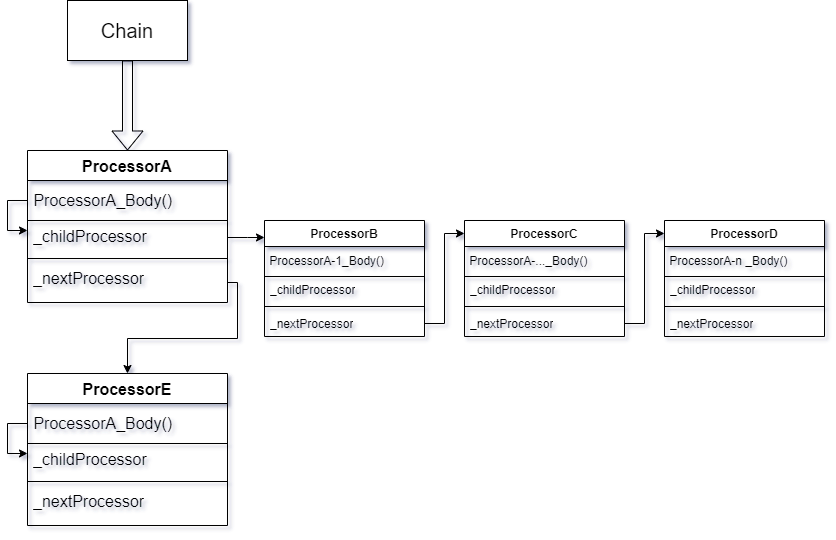

# Processors Documentation

## Разница между ChainedWith() и EndChainWith()


### ChainedWith() возвращает то, что было передано в качестве аргумента

В случае
```
var Chain = ProcessorA
	    .ChainedWith(ProcessorB)
	    .ChainedWith(ProcessorC)  
```
__Chain__ будет указывать на __ProcessorC__, и при вызове
```
Chain.Execute()
```
Процессоры ProcessorA и ProcessorB не будут доступны. 
Следующий код, в данном случае, делает одно и тоже:
```
Chain.Execute()

ProcessorC.Execute()
```

")


### EndChainWith() возвращает то, что вызвало данный метод

В случае
```
var Chain = ProcessorA
	    .ChainedWith(ProcessorB)
	    .EndChainWith(ProcessorC)  
```
__Chain__ будет указывать на __ProcessorA__, и при вызове
```
Chain.Execute()
```
Процессоры ProcessorA, ProcessorB и ProcessorC выполнятся по цепочке в штатном режиме. 
Следующий код, в данном случае, делает одно и тоже:
```
Chain.Execute()

ProcessorA.Execute()
```

")


### Пример создания цепочки

```
ProcessorA
.SubChainedWith(ProcessorB
    .ChainedWith(ProcessorC)
    .EndChainWith(ProcessorD))
.EndChainWith(ProcessorE)
.Execute()
```

Данный код делает тоже самое, что и код ниже:

```
var subchain = ProcessorB
             .ChainedWith(ProcessorC)
             .EndChainWith(ProcessorD)

var processorA_WithSubchain = ProcessorA
                              .SubChainedWith(subchain)

var Chain = processorA_WithSubchain
            .EndChainWith(ProcessorE)
            
Chain.Execute()          
```
На диаграмме это можно оттобразить следующим образом:

