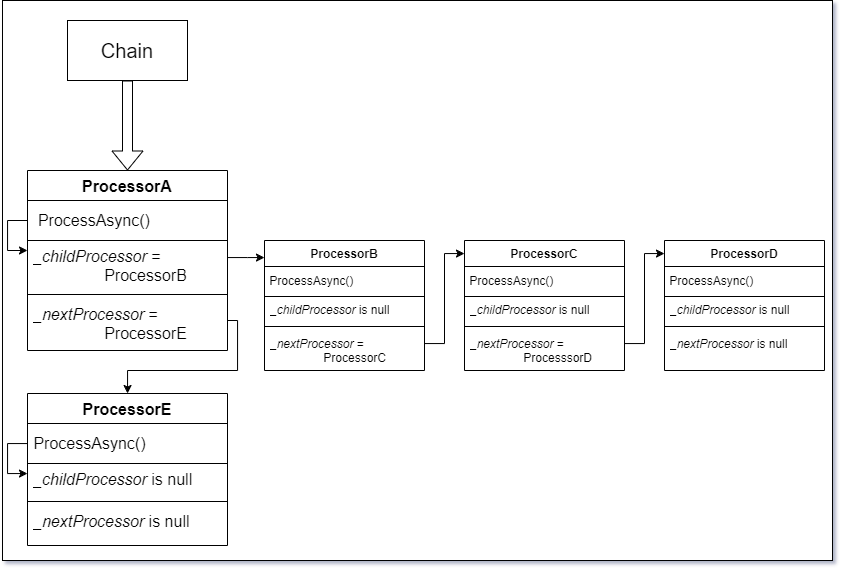

# Processors Documentation

## Разница между ChainedWith() и EndChainWith()


### ChainedWith() возвращает то, что было передано в качестве аргумента


В случае

```
var Chain = ProcessorA
	    .ChainedWith(ProcessorB)
	    .ChainedWith(ProcessorC)  
```

__Chain__ будет указывать на __ProcessorC__, и при вызове __Chain.ProcessChainAsync()__, процессоры __ProcessorA__ и __ProcessorB__ не будут доступны.

Следующий код, в данном случае, делает одно и тоже:

```
Chain.ProcessChainAsync()
```

```
ProcessorC.ProcessChainAsync()
```


")


### EndChainWith() возвращает то, что вызвало данный метод

В случае

```
var Chain = ProcessorA
	    .ChainedWith(ProcessorB)
	    .EndChainWith(ProcessorC)  
```

__Chain__ будет указывать на __ProcessorA__, и при вызове __Chain.ProcessChainAsync()__, процессоры ProcessorA, ProcessorB и ProcessorC выполнятся по цепочке в штатном режиме. 
Следующий код, в данном случае, делает одно и тоже:

```
Chain.ProcessChainAsync()
```

```
ProcessorA.ProcessChainAsync()
```

")


## Пример создания цепочки

```
ProcessorA
.SubChainedWith(ProcessorB
    .ChainedWith(ProcessorC)
    .EndChainWith(ProcessorD))
.EndChainWith(ProcessorE)
.ProcessChainAsync()
```

Данный код делает тоже самое, что и код ниже:

```
var subchain = ProcessorB
             .ChainedWith(ProcessorC)
             .EndChainWith(ProcessorD)

var processorA_WithSubchain = ProcessorA
                              .SubChainedWith(subchain)

var Chain = processorA_WithSubchain
            .EndChainWith(ProcessorE)
            
Chain.ProcessChainAsync()          
```
На диаграмме это можно оттобразить следующим образом:



## Последовательность выполения __ProcessChainAsync()__

```
ProcessorA
.SubChainedWith(ProcessorB
    .ChainedWith(ProcessorC)
    .EndChainWith(ProcessorD))
.EndChainWith(ProcessorE)
.ProcessChainAsync()
```

### Последовательность выполнения __ProcessChainAsync()__ если ProcessorA выполнится:

ᐯ \
├──&nbsp; __1__ ProcessorA \
&nbsp;__|__&emsp;&emsp;├── __2__ ProcessorB \
&nbsp;__|__&emsp;&emsp;├── __3__ ProcessorC \
&nbsp;__|__&emsp;&emsp;└── __4__ ProcessorD \
&nbsp;__|__ \
└──&nbsp; __5__ ProcessorE

### Последовательность выполнения __ProcessChainAsync()__ если ProcessorA __НЕ__ выполнится:

ᐯ \
└──&nbsp; __5__ ProcessorE


